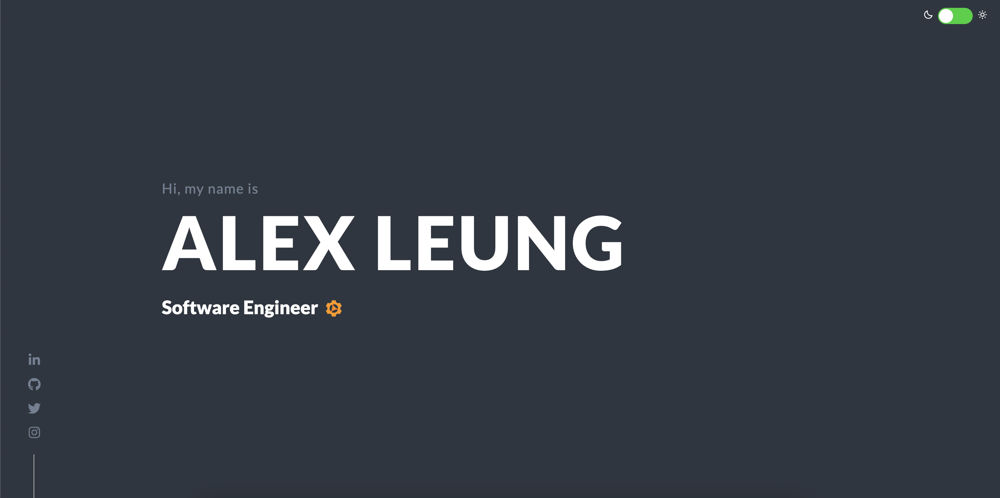

# alexleung.ca

Personal portfolio website built with Next.js, TypeScript, and Tailwind CSS. Deployed to GitHub Pages using static export.



## :construction: Installation & Setup

1. Clone this repo

1. Install dependencies

   ```bash
   nvm use
   yarn install
   ```

1. Start the development server

   ```bash
   yarn dev
   ```

## :ship: Deployment

The site is automatically deployed to GitHub Pages using static export. To deploy manually:

1. Ensure the `CNAME` is correct, then build and deploy

   ```bash
   yarn deploy
   ```

## :gear: Architecture

This is a Next.js application configured for static export to work with GitHub Pages:

- **Framework**: Next.js 15 with TypeScript
- **Styling**: Tailwind CSS with custom themes
- **Deployment**: Static export (`output: 'export'`) deployed to GitHub Pages
- **Build Output**: Static files generated in the `out/` directory

### .nojekyll File

The `.nojekyll` file is included in both `public/` and `out/` directories to prevent GitHub Pages from processing the site with Jekyll. This is necessary because:

- Jekyll ignores files/folders starting with underscores (like Next.js `_next/` directory)
- The `.nojekyll` file tells GitHub Pages to serve files as-is without Jekyll processing
- Without this file, Next.js assets in `_next/` would be ignored, breaking the site

## :clipboard: Project Structure

```bash
src/
├── app/
│   ├── globals.css          # Global styles and Tailwind imports
│   ├── layout.tsx           # Root layout with SEO metadata
│   └── page.tsx             # Main page component
│
├── components/
│   ├── colour-theme/
│   │   ├── Toggler.tsx      # Dark/light mode toggle component
│   │   └── useDarkMode.ts   # Dark mode state management hook
│   │
│   ├── About.tsx            # About section component
│   ├── Contact.tsx          # Contact section component
│   ├── Footer.tsx           # Footer component
│   ├── Home.tsx             # Hero/landing section
│   ├── Skills.tsx           # Skills showcase component
│   ├── SocialLinks.tsx      # Social media links component
│   └── Title.tsx            # Page title component
│
└── constants/
    ├── skills.ts            # Skills data and configuration
    └── socialLinks.tsx      # Social media links configuration
```

## :memo: Improvements & Future Work

### 🎯 Medium Priority

- **Analytics Integration**: Consider privacy-friendly analytics (Plausible, Fathom)
- **Performance**: Consider service worker for offline functionality
- **Accessibility**: Improve keyboard navigation, add focus indicators

### 🔧 Low Priority

- **SEO Enhancements**: Add blog/portfolio sections, improve Open Graph images, add JSON-LD for projects
- **Development Experience**: Add pre-commit hooks, improve build scripts, consider Prettier integration
